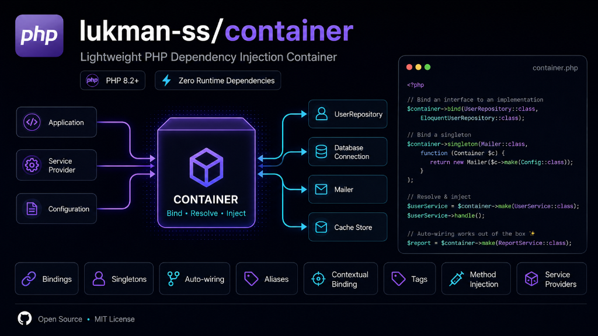

# Lukman Container



A lightweight dependency injection container for PHP 8.2+ with zero runtime dependencies.

## Features

- Bindings, singletons, and existing instances
- Alias, remove, and flush helpers
- Reflection constructor auto-wiring
- Contextual binding for class dependencies
- Tags for grouped lazy resolution
- Method injection via `call()`
- Service providers

## Requirements

- PHP 8.2 or higher

## Installation

```bash
composer require lukman-ss/container
```

## Basic Usage

```php
use Lukman\Container\Container;

$container = new Container();

$container->bind('config', ['debug' => true]);

$config = $container->get('config');
```

## Bindings

```php
use Lukman\Container\Container;

final class Logger
{
}

$container = new Container();

$container->bind(Logger::class);

$loggerA = $container->get(Logger::class);
$loggerB = $container->get(Logger::class);
```

## Singletons

```php
$container->singleton(Logger::class);

$loggerA = $container->get(Logger::class);
$loggerB = $container->get(Logger::class);
```

## Instances

```php
$logger = new Logger();

$container->instance(Logger::class, $logger);

$sameLogger = $container->get(Logger::class);
```

## Auto-wiring

```php
final class UserRepository
{
    public function __construct(public Logger $logger)
    {
    }
}

$repository = $container->get(UserRepository::class);
```

## Aliases

```php
$container->bind(Logger::class);
$container->alias(Logger::class, 'logger');

$logger = $container->get('logger');
```

## Contextual Binding

```php
interface LoggerInterface
{
}

final class FileLogger implements LoggerInterface
{
}

final class Worker
{
    public function __construct(public LoggerInterface $logger)
    {
    }
}

$container->when(Worker::class)
    ->needs(LoggerInterface::class)
    ->give(FileLogger::class);

$worker = $container->get(Worker::class);
```

## Tags

```php
$container->bind('first_logger', fn () => new Logger());
$container->bind('second_logger', fn () => new Logger());

$container->tag(['first_logger', 'second_logger'], 'loggers');

$loggers = $container->tagged('loggers');
```

## Method Injection

```php
$result = $container->call(function (Logger $logger): Logger {
    return $logger;
});
```

## Service Providers

```php
use Lukman\Container\Container;
use Lukman\Container\ServiceProviderInterface;

final class AppServiceProvider implements ServiceProviderInterface
{
    public function register(Container $container): void
    {
        $container->singleton(Logger::class);
    }

    public function boot(Container $container): void
    {
    }
}

$container->register(AppServiceProvider::class);
$container->boot();
```

## Tests

```bash
composer test
```
